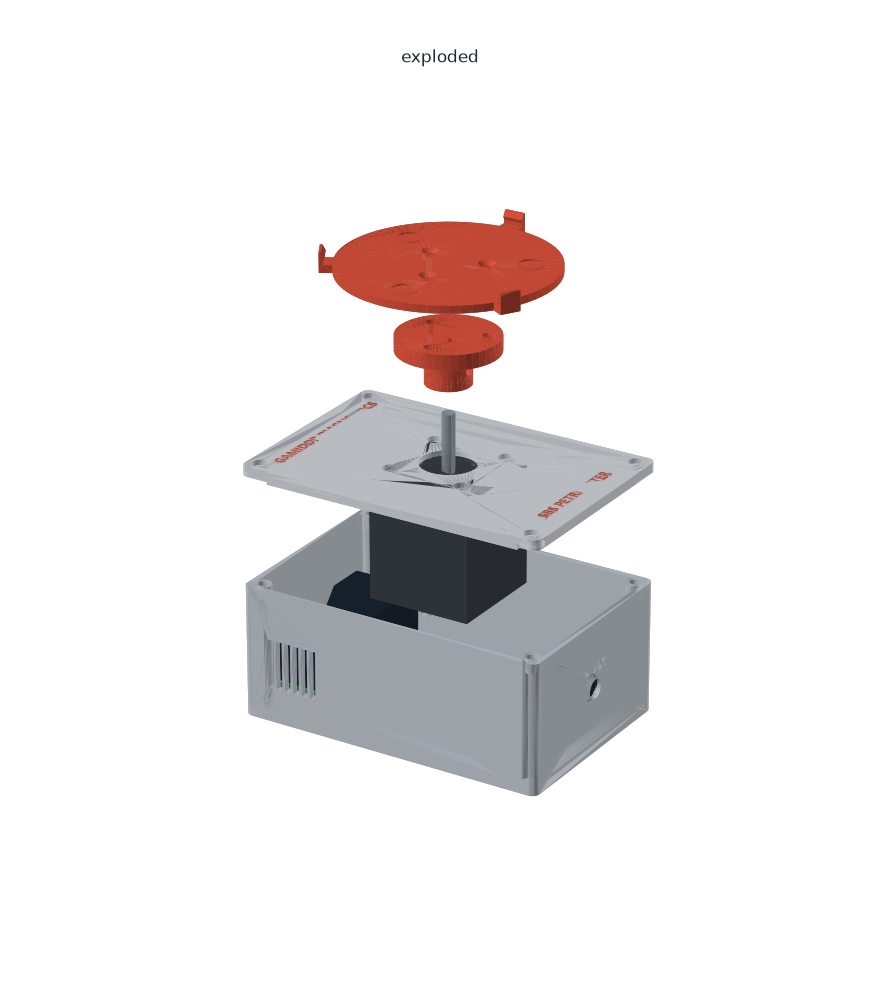
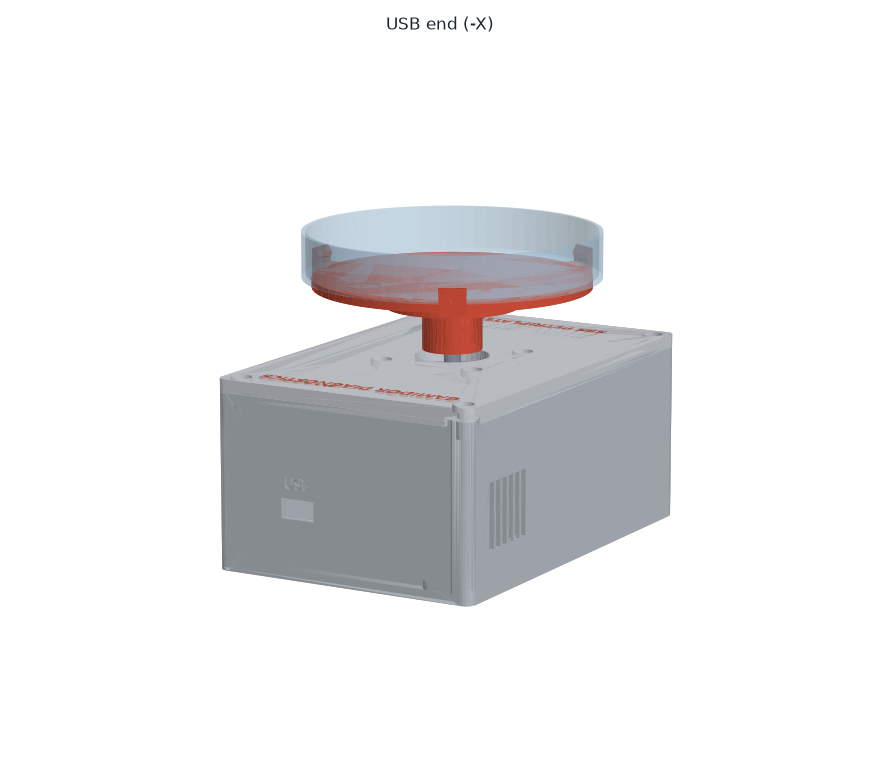

# קופסה מודפסת — SBS PetriPlater

קופסה בטביעת רגל של צלחת מיקרו-טיטר (**SBS**, ‏127.76 × 85.48 מ"מ), כך שהמכשיר נכנס לעמדה רגילה
על משטח הרובוט. המנוע בפנים, הציר יוצא למעלה, ועליו קן שמחזיק צלחת פטרי 90 מ"מ.


| | |
|---|---|
|  |  |

---

## החלקים

| קובץ | חלק | כיוון הדפסה |
|---|---|---|
| `stl/base.stl` | גוף הקופסה: דפנות, עמודי ברגים, מעמדים ללוח, חלון USB, חור לשקע מתח, חריצי אוורור | כמו שהוא, הפתח למעלה |
| `stl/lid.stl` | מכסה. המנוע תלוי מתחתיו | **הפוך** — הצד העליון על המשטח (כבר מסובב בקובץ) |
| `stl/lid_text.stl` | הכיתוב של המכסה, כגוף נפרד | יחד עם `lid.stl`, בצבע שני |
| `stl/hub.stl` | תופס את ציר המנוע | הפלנג' הרחב על המשטח (כבר מסובב בקובץ) |
| `stl/plate.stl` | הקן: הצלחת יושבת עליו, 3 תפסים מחזיקים אותה | כמו שהוא, התפסים למעלה |

הקבצים ב-`stl/` כבר מסובבים ומונחים על המשטח. ב-`step/` — אותם חלקים במצב מורכב, לעריכה ב-CAD.


### הגדרות הדפסה (Bambu Lab, PETG)

| חלק | שכבה | דפנות | מילוי | תמיכות |
|---|---|---|---|---|
| base | 0.2 מ"מ | 3 | 15% gyroid | לא |
| lid + lid_text | 0.2 מ"מ | 3 | 15% gyroid | לא |
| hub | 0.2 מ"מ | 5 | 50% gyroid | לא |
| plate | 0.2 מ"מ | 4 | 30% gyroid | לא |

**כיתוב בשני צבעים (AMS):** לגרור את `lid.stl` ואת `lid_text.stl` **ביחד** ל-Bambu Studio,
ולענות **Yes** לשאלה אם לטעון כחלקים של אובייקט אחד. לבחור ל-`lid_text` פילמנט כתום.
הכיתוב נמצא בשכבות הראשונות (הצד העליון של המכסה מודפס על המשטח).
בלי AMS — להדפיס רק את `lid.stl`; הכיתוב יהיה חרוט.

---

## חומרה לקנייה

| פריט | כמות | איפה |
|---|---|---|
| תותבת הברגה M3 לחימום (M3 × 5.7, קוטר חיצוני 4.6) | 8 | 4 בעמודי הבסיס, 3 בפלנג' של ה-hub, 1 בצד ה-hub |
| בורג M3 × 8 ראש כפתור (button head) | 4 | מכסה ← בסיס |
| בורג M3 × 6 ראש כפתור | 4 | מנוע ← מכסה |
| בורג M3 × 8 ראש שקוע (flat head) | 3 | קן ← hub |
| בורג ללא ראש (grub / set screw) M3 × 8 | 1 | hub ← ציר המנוע |
| בורג M2.5 × 6 (או בורג מתכת לפלסטיק) | 4 | לוח ← מעמדים |
| שקע מתח לפאנל 5.5 × 2.1 (DC-022B, חור 8 מ"מ) | 1 | דופן +X |
| לוח חורים (Perfboard) 30 × 70, לקצר ל-30 × 60 | 1 | |
| פס שקעים נקבה (female header) 2.54 | 2×7 + 2×8 | ל-XIAO ולדרייבר — אפשר להחליף אותם בלי הלחמה |
| מדבקות סיליקון נגד החלקה, Ø10 | 3 | בשקעים שעל הקן (לא חובה) |

---

## לפני ההדפסה — למדוד

המידות בראש `build_enclosure.py`, מסומנות `(MEASURE)`:

| פרמטר | מה למדוד | ברירת מחדל |
|---|---|---|
| `DISH_D` | קוטר חיצוני של תחתית הצלחת שהלקוח משתמש בה | 90.0 |
| `SHAFT_L` | אורך הציר מפני המנוע (לא מראש הבליטה העגולה) עד הקצה | 24.0 |
| `MOTOR_L` | אורך גוף המנוע | 48.0 |
| `USB_Y`, `USB_Z` | מיקום מרכז שקע ה-USB-C **אחרי** הלחמת הלוח (ראו למטה) | 15.0, 21.3 |
| `DC_HOLE_D` | קוטר ההברגה של שקע המתח שקניתם | 8.0 |

**סדר מומלץ:** להלחים את הלוח קודם → למדוד את מיקום ה-USB-C → לעדכן → להריץ → להדפיס את הבסיס.
את המכסה, ה-hub והקן אפשר להדפיס כבר עכשיו.

### עדכון והרצה

```bash
"C:\Program Files\FreeCAD 1.1\bin\freecadcmd.exe" -c "exec(open(r'enclosure/build_enclosure.py', encoding='utf-8').read(), {'__file__': r'enclosure/build_enclosure.py'})"
```
```bash
.venv\Scripts\python enclosure\preview_enclosure.py
```

הסקריפט הראשון מייצר את `stl/`, `step/` ו-`build_report.txt`. הדוח בודק התנגשויות בין החלקים
לבין מודלים פשוטים של המנוע, הלוח, שקע ה-USB ושקע המתח — צריך להיות בו **אפס** שורות `COLLISION`.
השני מצייר את התמונות ב-`preview/` (צריך `matplotlib` בסביבה).

---

## הלוח (Perfboard)

- 30 × 60 מ"מ, בצד ה-USB של המנוע. 4 חורים בפינות, 2.5 מ"מ מהקצוות, לברגי M2.5.
- **ה-XIAO בקצה הלוח שפונה לדופן ה-USB**, עם שקע ה-USB-C לכיוון הדופן, כ-1.5 מ"מ מקצה הלוח.
- הדרייבר על שקעים נקבה, צלע הקירור למעלה, קרוב לחריצי האוורור שבדפנות הארוכות.
- הקבל 100µF צמוד לפינים `VM`/`GND` של הדרייבר.
- החיווט — [WIRING.md](../WIRING.md).

---

## הרכבה

1. **תותבות:** להכניס עם מלחם (כ-230°C) — 4 בראשי עמודי הבסיס, 3 בפלנג' של ה-hub מהצד השטוח,
   1 בחור הצדדי של ה-hub.
2. **שקע מתח:** להבריג לדופן +X, להלחים חוטים ל-24V של הלוח.
3. **לוח:** להבריג על 4 המעמדים. לוודא שה-USB-C מול החלון ושהתקע נכנס עד הסוף.
4. **מנוע:** להבריג מתחת למכסה (4 × M3×6). הבליטה העגולה נכנסת לחור המרכזי.
   **לחבר את חוטי המנוע ללוח כשאין 24V.**
5. **מכסה:** להניח על הבסיס (השוליים שמתחתיו נכנסים לדפנות), 4 × M3×8.
6. **hub:** להשחיל על הציר, הבורג הצדדי מול הצד השטוח של הציר, ולהדק. בין ה-hub למכסה צריך להישאר רווח של כ-2 מ"מ.
7. **קן:** להבריג ל-hub (3 × M3×8 ראש שקוע). להדביק את מדבקות הסיליקון בשקעים.
8. בדיקה: `platter.exe rotate 1 20 cw` — הקן מסתובב חופשי, בלי לשפשף במכסה.

---

## הצלחת והרובוט

- התפסים **נמוכים (5 מ"מ)** ותופסים את תחתית דופן הצלחת. **דופן הצלחת מעליהם פנויה מכל הצדדים**
  לאצבעות של הרובוט, בכל זווית שבה הקן עצר.
- **גובה תחתית הצלחת: 81.4 מ"מ** מעל משטח העבודה — לכייל את הרובוט לגובה הזה.
- הקן (Ø84) נכנס ברוחב ה-SBS ‏(85.48). הצלחת עצמה (Ø90) והתפסים בולטים עד כ-5 מ"מ מעבר לרוחב,
  מעל הקופסה — לבדוק שאין שם התנגשות עם עמדות שכנות.
- **להוריד את הגובה:** לקצר את ציר המנוע (למשל ל-12 מ"מ) ולעדכן `SHAFT_L` — כל מ"מ שמקצרים מוריד מ"מ.
  או מנוע NEMA17 שטוח (pancake).
