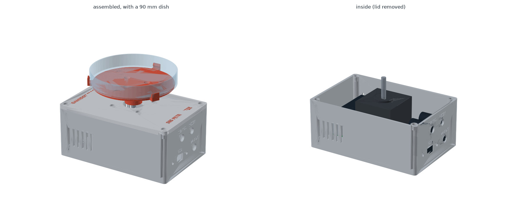
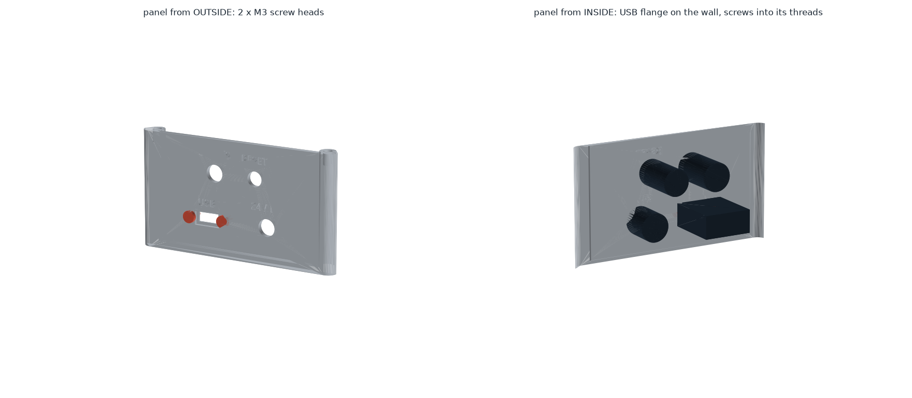
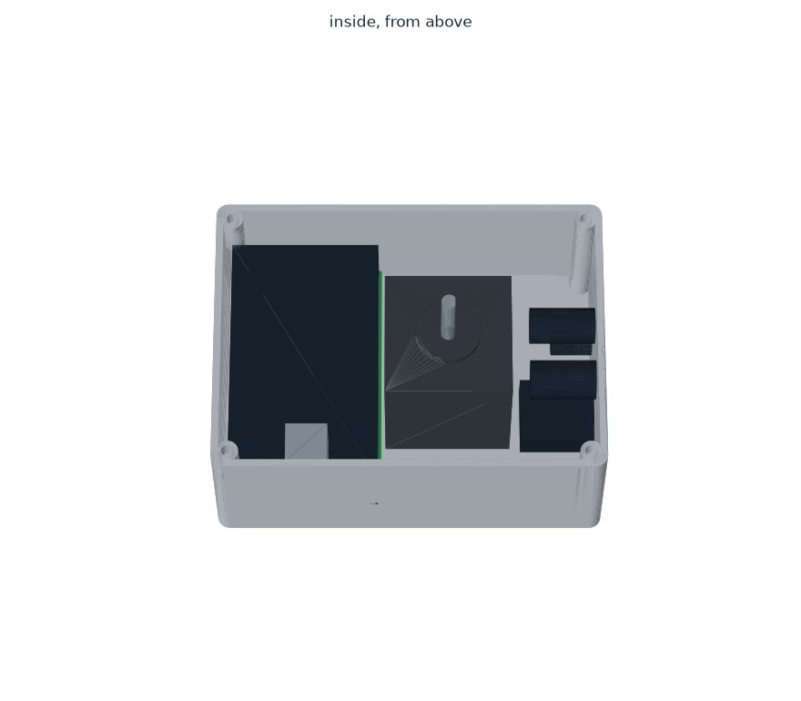
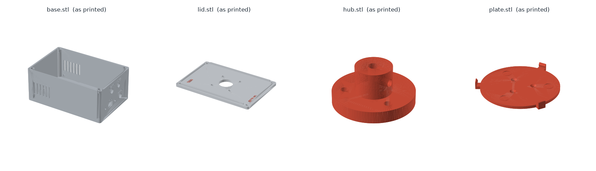

# קופסה מודפסת — SBS PetriPlater

קופסה של **130 × 96 × 57 מ"מ**. המנוע בפנים, הציר יוצא למעלה, ועליו קן שמחזיק צלחת פטרי 90 מ"מ.
בצד שמאל — לוח ההלחמה המלא (89 × 52, בלי חיתוך). בצד ימין — **פאנל חיבורים**: USB, ‏24V, לד STATUS וכפתור RESET.

> הקופסה **רחבה מטביעת SBS** (127.76 × 85.48) כדי שהלוח ייכנס בלי לחתוך אותו.
> היא לא נכנסת לעמדת צלחת רגילה על משטח הרובוט — צריך מקום ייעודי.



| | |
|---|---|
|  |  |

---

## החלקים

| קובץ | חלק | כיוון הדפסה |
|---|---|---|
| `stl/base.stl` | גוף הקופסה: דפנות, עמודי ברגים, מעמדים ללוח, פאנל חיבורים (ימין), חריצי אוורור (שמאל) | כמו שהוא, הפתח למעלה |
| `stl/lid.stl` | מכסה. המנוע תלוי מתחתיו | **הפוך** — הצד העליון על המשטח (כבר מסובב בקובץ) |
| `stl/lid_text.stl` | הכיתוב של המכסה, כגוף נפרד | יחד עם `lid.stl`, בצבע שני |
| `stl/hub.stl` | תופס את ציר המנוע | הפלנג' הרחב על המשטח (כבר מסובב בקובץ) |
| `stl/plate.stl` | הקן: הצלחת יושבת עליו, 3 תפסים מחזיקים אותה | כמו שהוא, התפסים למעלה |

הקבצים ב-`stl/` כבר מסובבים ומונחים על המשטח. ב-`step/` — אותם חלקים במצב מורכב, לעריכה ב-CAD.
**כל החלקים מודפסים בלי תמיכות.** שני עמודי הברגים שמעל הלוח "תלויים" מלמעלה ומסתיימים בחרוט של 45° —
גם הם בלי תמיכות.



### הגדרות הדפסה (Bambu Lab, PETG)

| חלק | שכבה | דפנות | מילוי | תמיכות |
|---|---|---|---|---|
| base | 0.2 מ"מ | 3 | 15% gyroid | לא |
| lid + lid_text | 0.2 מ"מ | 3 | 15% gyroid | לא |
| hub | 0.2 מ"מ | 5 | 50% gyroid | לא |
| plate | 0.2 מ"מ | 4 | 30% gyroid | לא |

**כיתוב בשני צבעים (AMS):** לגרור את `lid.stl` ואת `lid_text.stl` **ביחד** ל-Bambu Studio,
ולענות **Yes** לשאלה אם לטעון כחלקים של אובייקט אחד. לבחור ל-`lid_text` פילמנט כתום.
בלי AMS — להדפיס רק את `lid.stl`; הכיתוב יהיה חרוט.

---

## פאנל החיבורים (הדופן הימנית)

```
        STATUS          RESET
        ( 8 )           ( 7 )

   USB                  24V DC
 o [==]  o              ( 8 )
```

| חיבור | חור | הרכבה |
|---|---|---|
| **USB** | חלון 10 × 4.5 מ"מ + שקע רדוד 12.4 × 7 לראש התקע, 2 חורי מעבר M3 (3.4) במרחק 17 | שקע ה-USB והפלנץ שלו **צמודים לדופן מבפנים**. 2 ברגי M3 נכנסים **מבחוץ**, עוברים דרך הדופן ומתברגים לחורי ההברגה שבפלנץ |
| **24V DC** | Ø8 | שקע 5.5 × 2.1 לפאנל (DC-022B), אום מבפנים |
| **STATUS** | Ø8 | בית ללד 5 מ"מ |
| **RESET** | Ø7 | לחצן רגעי |


בגלל שהשקע יושב מאחורי הדופן, ראש הפלסטיק של תקע ה-USB נכנס לשקע הרדוד, והדופן מול השקע היא רק 0.8 מ"מ —
כך התקע נכנס (כמעט) עד הסוף.

---

## חומרה לקנייה

| פריט | כמות | איפה |
|---|---|---|
| תותבת הברגה M3 לחימום (M3 × 5.7, קוטר חיצוני 4.6) | 8 | 4 בעמודי הבסיס, 3 בפלנג' של ה-hub, 1 בצד ה-hub |
| בורג M3 × 8 ראש כפתור (button head) | 4 | מכסה ← בסיס |
| בורג M3 × 6 ראש כפתור | 4 | מנוע ← מכסה |
| בורג M3 × 8 ראש שקוע (flat head) | 3 | קן ← hub |
| בורג ללא ראש (grub / set screw) M3 × 8 | 1 | hub ← ציר המנוע |
| בורג M3 × 8 | 2 | לוח ← מעמדים |
| כבל USB-C מאריך לפאנל (עם 2 ברגי M3) | 1 | פאנל |
| **מתאם USB-C 90°** (זכר-נקבה, L, זווית למעלה) | 1 | על ה-XIAO |
| שקע מתח לפאנל 5.5 × 2.1 (DC-022B, חור 8 מ"מ) | 1 | פאנל |
| לד 5 מ"מ + בית ללד 8 מ"מ | 1 | פאנל |
| לחצן רגעי (NO), חור 7 מ"מ | 1 | פאנל |
| לוח הלחמה בסגנון מטריצה 89 × 52 | 1 | [perfboard/README.md](../perfboard/README.md) |
| פס שקעים נקבה (female header) 2.54 | 2×7 + 2×8 | ל-XIAO ולדרייבר |
| מדבקות סיליקון נגד החלקה, Ø10 | 3 | בשקעים שעל הקן (לא חובה) |

---

## לפני ההדפסה — למדוד

המידות בראש `build_enclosure.py`, מסומנות `(MEASURE)`:

| פרמטר | מה למדוד | ברירת מחדל |
|---|---|---|
| `PB_MOUNT_DY` | מרחק בין מרכזי שני חורי ההרכבה של הלוח (במרכז הקצוות הקצרים) | 73.5 (נמדד) |
| `DISH_D` | קוטר חיצוני של תחתית הצלחת שהלקוח משתמש בה | 90.0 |
| `SHAFT_L` | אורך הציר מפני המנוע (לא מראש הבליטה העגולה) עד הקצה | 24.0 |
| `MOTOR_L` | אורך גוף המנוע | 48.0 |
| `DC_HOLE_D` | בתוך `PANEL`: קוטר ההברגה של שקע המתח | 8.0 |

כל המידות של הלוח ושל שקע ה-USB נמדדו — **כל החלקים מוכנים להדפסה.**

### עדכון והרצה

**כמקרו ב-FreeCAD** (מציג את הקופסה ומייצר את הקבצים):
FreeCAD ← File ← Open ← `enclosure/build_enclosure.py` ← Macro ← Execute macro (Ctrl+F6).

**בלי חלון**, מתיקיית הפרויקט:

```bash
"C:\Program Files\FreeCAD 1.1\bin\freecadcmd.exe" -c "exec(open(r'enclosure/build_enclosure.py', encoding='utf-8').read(), {'__file__': r'enclosure/build_enclosure.py'})"
```
```bash
.venv\Scripts\python enclosure\preview_enclosure.py
```

`build_report.txt` בודק התנגשויות בין החלקים לבין מודלים של המנוע, הלוח, מתאם ה-USB וחלקי הפאנל —
צריך להיות בו **אפס** שורות `COLLISION`.

---

## הרכבה

1. **תותבות:** עם מלחם (כ-230°C) — 4 בראשי עמודי הבסיס, 3 בפלנג' של ה-hub מהצד השטוח, 1 בחור הצדדי של ה-hub.
2. **פאנל:** כבל ה-USB (פלנץ מבפנים, 2 × M3 מבחוץ), שקע 24V, בית הלד, הכפתור.
3. **לוח:** 2 ברגי M3 בחורי ההרכבה, שורה 1 לכיוון הדופן הקדמית. מתאם 90° על ה-USB של ה-XIAO, והכבל אליו.
4. **חוטים:** 24V, לד וכפתור מהפאנל ללוח — לפי [perfboard/README.md](../perfboard/README.md).
5. **מנוע:** להבריג מתחת למכסה (4 × M3×6). **לחבר את מחבר המנוע ללוח כשאין 24V.**
6. **מכסה:** להניח על הבסיס (השוליים שמתחתיו נכנסים לדפנות), 4 × M3×8.
7. **hub:** להשחיל על הציר, הבורג הצדדי מול הצד השטוח של הציר, ולהדק. רווח של כ-2 מ"מ מהמכסה.
8. **קן:** להבריג ל-hub (3 × M3×8 ראש שקוע). מדבקות סיליקון בשקעים.
9. בדיקה: `platter.exe rotate 1 20 cw` — הקן מסתובב חופשי, בלי לשפשף במכסה.

---

## הצלחת והרובוט

- התפסים **נמוכים (5 מ"מ)** ותופסים את תחתית דופן הצלחת. **דופן הצלחת מעליהם פנויה מכל הצדדים**
  לאצבעות של הרובוט, בכל זווית שבה הקן עצר.
- **גובה תחתית הצלחת: 81.4 מ"מ** מעל משטח העבודה.
- **מרכז הצלחת לא במרכז הקופסה:** הוא 13 מ"מ ימינה (לכיוון הפאנל). לכייל את הרובוט למרכז הצלחת.
- **להוריד את הגובה:** לקצר את ציר המנוע ולעדכן `SHAFT_L` — כל מ"מ שמקצרים מוריד מ"מ. או מנוע NEMA17 שטוח.
