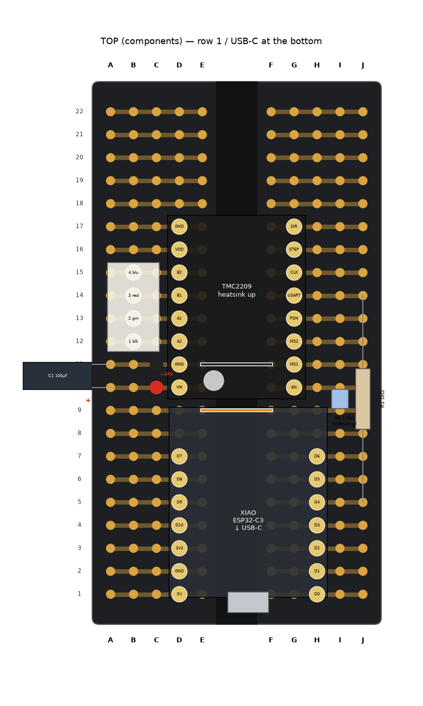
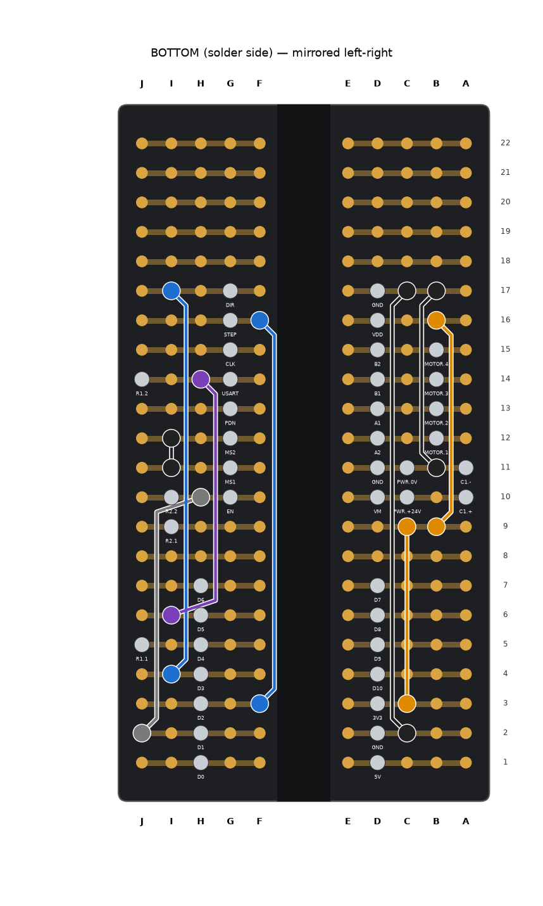

# לוח ההלחמה — PetriTurn

הלוח: **לוח הלחמה בסגנון מטריצה, 89 × 52 מ"מ, בשלמותו — בלי חיתוך.** 30 שורות.
בכל שורה **A–E מחוברים** ו-**F–J מחוברים**, ואין חיבור בין E ל-F — בדיוק כמו במטריצה שעליה המערכת עבדה.
הבקר והדרייבר יושבים **מעל התעלה שבאמצע**, וכל פין מקבל פס משלו. **פסי המתח שבצדדים לא בשימוש.**

הסידור מוגדר ב-`layout.py` **ונבדק אוטומטית מול [WIRING.md](../WIRING.md)**, כולל הפסים שבכל שורה:
כל חיבור קיים, אין קצר, ו-PDN, CLK ופיני ה-XIAO שלא בשימוש לבד בפס שלהם.
כל מיקומי החורים במסמך הזה נוצרו מאותם נתונים, וטבלת המולטימטר נבדקה מולם.

```bash
.venv\Scripts\python perfboard\layout.py
```

| מלמעלה — רכיבים | מלמטה — חוטים (**הפוך כמו מראה**) |
|---|---|
|  |  |

---

## 1. הלוח בקופסה

- הלוח שוכב בצד **השמאלי** של הקופסה (ליד חריצי האוורור), המנוע באמצע, פאנל החיבורים מימין.
- **שורה 1 לכיוון הדופן הארוכה הקדמית.** העמודות A–J לרוחב.
- מוחזק ב-**2 ברגי M3** בחורי ההרכבה שבמרכז הקצוות הקצרים (על קו התעלה), ועוד 4 רגליות תמיכה בפינות.
- **שורות 1–6 נשארות פנויות:** שקע ה-USB-C של ה-XIAO פונה אליהן, ושם יושב **מתאם USB-C בזווית 90°**
  (זכר-נקבה, בצורת L, זווית למעלה). הכבל לפאנל יוצא ממנו כלפי מעלה.

**לבדוק לפני שמתחילים:** המרחק בין מרכז החור E1 למרכז החור F1 — צריך להיות **כ-7.6 מ"מ**.

---

## 2. הרכיבים

| רכיב | ערך | מיקום | הערה |
|---|---|---|---|
| **XIAO ESP32-C3** | על 2 × 7 שקעים נקבה | עמודה `D`, שורות 7–13: 5V, GND, 3V3, D10, D9, D8, D7 · עמודה `H`, שורות 7–13: D0 … D6 | **שקע ה-USB-C לכיוון שורה 1** |
| **TMC2209** (V985) | על 2 × 8 שקעים נקבה | עמודה `D`, שורות 16–23: VM, GND, A2, A1, B1, B2, VDD, GND · עמודה `G`, שורות 16–23: EN, MS1, MS2, PDN, USART, CLK, STEP, DIR | **הפוטנציומטר לכיוון ה-XIAO** (שורה 16), צלע קירור למעלה |
| **R1** | 1kΩ | `J11` – `J20` | שוכב לאורך עמודה J |
| **R2** | 10kΩ | `I15` – `I16` | **עומד** |
| **R3** | 330Ω | `B10` – `B14` | שוכב לאורך עמודה B — נגד ללד |
| **C1** | 100µF / 35V | **+** ב-`A16`, **−** ב-`A17` | **שוכב** מעל אזור פסי המתח (שלא בשימוש). **קוטביות!** |
| **מחבר מנוע** | JST-XH 4 פינים | `B18` (1), `B19` (2), `B20` (3), `B21` (4) | 1 = שחור, 2 = ירוק, 3 = אדום, 4 = כחול |
| **כניסת 24V** | חוטים משקע המתח | **+24V** ל-`C16`, **0V** ל-`C17` | |
| **לד STATUS** (בפאנל) | לד 5 מ"מ בבית 8 מ"מ | רגל ארוכה (+) ← `A14`, רגל קצרה (−) ← `A8` | חוטים לפאנל |
| **כפתור RESET** (בפאנל) | לחצן רגעי (NO), חור 7 מ"מ | רגל אחת ← `B8` (GND), רגל שנייה ← **משטח EN בגב ה-XIAO** | ראו סעיף 4 |

- השקעים הנקבה מאפשרים להחליף את הבקר והדרייבר בלי הלחמה. מלחימים את השקעים, לא את הרכיבים.

### מה עובר בכל שורה

| שורה | A–E (שמאל) | F–J (ימין) |
|---|---|---|
| 1–6 | — (**פנוי: מקום למתאם ה-USB**) | — |
| 7 | XIAO.5V | XIAO.D0 |
| 8 | XIAO.GND, **LED− (לפאנל)**, **RESET (לפאנל)**, W11 | XIAO.D1, W4 |
| 9 | XIAO.3V3, W2 | XIAO.D2, W5 |
| 10 | XIAO.D10, R3 | XIAO.D3, W6 |
| 11 | XIAO.D9 | XIAO.D4, R1 |
| 12 | XIAO.D8 | XIAO.D5, W7 |
| 13 | XIAO.D7 | XIAO.D6 |
| 14 | R3, **LED+ (לפאנל)** | — |
| 15 | **פס 3.3V**: W1, W2, W3 | **פס 3.3V**: R2, W1 |
| 16 | TMC.VM, C1 +, **+24V** | TMC.EN, R2, W4 |
| 17 | TMC.GND, C1 −, **0V**, W8, W10 | TMC.MS1, W8, W9 |
| 18 | TMC.A2, מנוע 1 | TMC.MS2, W9 |
| 19 | TMC.A1, מנוע 2 | TMC.PDN — **לבד** |
| 20 | TMC.B1, מנוע 3 | TMC.USART, R1, W7 |
| 21 | TMC.B2, מנוע 4 | TMC.CLK — **לבד** |
| 22 | TMC.VDD, W3 | TMC.STEP, W5 |
| 23 | TMC.GND, W10, W11 | TMC.DIR, W6 |
| 24–30 | — | — |

---

## 3. חוטים

רוב החיבורים נעשים **דרך הפסים**. החוטים רק מחברים בין פסים שצריכים להיפגש.

| חוט | מה | מ- | אל | צד | צבע |
|---|---|---|---|---|---|
| W1 | פס 3.3V — מחבר את שני חצאי שורה 15 | `E15` | `F15` | למעלה (קצר) | כתום |
| W2 | 3V3 של ה-XIAO ← פס 3.3V | `C9` | `C15` | למטה | כתום |
| W3 | פס 3.3V ← VDD של הדרייבר | `B15` | `B22` | למטה | כתום |
| W4 | D1 ← EN | `J8` | `H16` | למטה | אפור |
| W5 | D2 ← STEP | `F9` | `F22` | למטה | כחול |
| W6 | D3 ← DIR | `I10` | `I23` | למטה | כחול |
| W7 | D5 ← USART | `I12` | `H20` | למטה | סגול |
| W8 | MS1 ← GND (מעל התעלה) | `E17` | `F17` | למעלה (קצר) | שחור |
| W9 | MS2 ← MS1 / GND | `I18` | `I17` | למטה | שחור |
| W10 | GND של המתח ↔ GND של הלוגיקה | `B17` | `B23` | למטה | שחור |
| W11 | GND של ה-XIAO ← GND | `C8` | `C23` | למטה | שחור |

- **D4 ← USART** עובר דרך R1, ו-**D10 ← לד** עובר דרך R3 — בלי חוט נוסף.
- W1, W8 קצרים, **מעל הלוח** (לפני שמכניסים את הדרייבר). W2, W3, W4, W5, W6, W7, W9, W10, W11 **מתחת ללוח** — לעבוד לפי `bottom.png` (הפוך כמו מראה).

---

## 4. חוט האיפוס — משטח EN בגב ה-XIAO

כפתור RESET עושה **איפוס אמיתי** (כמו כפתור RST שעל ה-XIAO): הוא מחבר את פין האיפוס EN ל-GND.
EN של ה-XIAO הוא **משטח קטן בגב הלוח שלו** (מסומן `EN`, ליד `MTDI` / `MTMS`), לא רגל.

1. להלחים חוט דק (0.1–0.2 מ"מ², או wire-wrap) למשטח `EN` — מלחם נקי, נגיעה קצרה.
2. להעביר אותו **בין שתי שורות השקעים**, מתחת ל-XIAO, ולצאת בצד — ה-XIAO עדיין נכנס לשקעים.
3. הקצה השני — לרגל של כפתור ה-RESET. הרגל השנייה של הכפתור ← `B8` (GND).
4. **בהחלפת XIAO** — להעביר את החוט ל-XIAO החדש.

---

## 5. סדר עבודה

1. לבדוק E1–F1 ≈ 7.6 מ"מ. לסמן שורה 1 בטוש.
2. **שקעים נקבה:** 2×7 ל-XIAO (עמודות D, H), 2×8 לדרייבר (עמודות D, G), בשורות שבטבלה.
3. W1, W8 (הקצרים, מלמעלה).
4. R1, R2 (עומד), R3, C1 (**קוטביות**), מחבר JST.
5. W2, W3, W4, W5, W6, W7, W9, W10, W11 מלמטה.
6. חוטים לפאנל (~25 ס"מ): LED+ מ-`A14`, LED− מ-`A8`, RESET מ-`B8`.
7. **בדיקה במולטימטר — בלי רכיבים ובלי מתח** (למטה).
8. חוטי 24V: אדום ל-`C16`, שחור ל-`C17`. חוט האיפוס מגב ה-XIAO לכפתור.
9. להכניס את ה-XIAO (USB-C לשורה 1) ואת הדרייבר (פוטנציומטר לכיוון ה-XIAO). מתאם 90° על ה-USB-C.
10. USB בלבד → `STATUS`. אחר כך 24V → `DIAG` צריך להחזיר `A0=12/0x21`.

---

## 6. בדיקה במולטימטר — בלי רכיבים, בלי מתח

מודדים על **חורים פנויים** באותם פסים (לא על השקעים).

| בין | צריך | מה זה בודק |
|---|---|---|
| `E16` ↔ `C17` | **נתק** | **אין קצר בין 24V ל-GND** |
| `E16` ↔ `E9` | **נתק** | **24V לא מגיע ל-3.3V** |
| `C17` ↔ `E8` | ≈0Ω | GND של הספק = GND של הבקר, הכפתור והלד |
| `C17` ↔ `E23` | ≈0Ω | GND של הלוגיקה בדרייבר |
| `C17` ↔ `H17` | ≈0Ω | MS1 ל-GND |
| `C17` ↔ `F18` | ≈0Ω | MS2 ל-GND |
| `E9` ↔ `E22` | ≈0Ω | 3.3V מגיע ל-VDD |
| `E9` ↔ `F16` | ≈10kΩ | R2: EN ← 3.3V |
| `F8` ↔ `F16` | ≈0Ω | D1 → EN |
| `G9` ↔ `H22` | ≈0Ω | D2 → STEP |
| `F10` ↔ `F23` | ≈0Ω | D3 → DIR |
| `F12` ↔ `F20` | ≈0Ω | D5 → USART |
| `F11` ↔ `F20` | ≈1kΩ | D4 → R1 → USART |
| `E10` ↔ `E14` | ≈330Ω | D10 → R3 → לד |
| `E18` ↔ `E19` | **נתק** | אין קצר בין חוטי המנוע |
| `E19` ↔ `E20` | **נתק** |  |
| `E20` ↔ `E21` | **נתק** |  |
| `F19` ↔ `F20` | **נתק** | PDN לבד |
| `F21` ↔ `H22` | **נתק** | CLK לבד |
